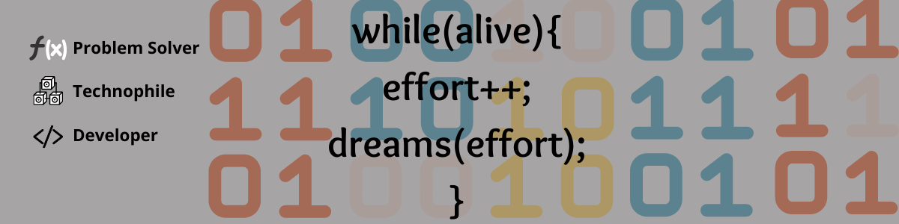

<h1 align="center">Hi 👋, I'm Swarnnika Raj Singh</h1>
<h3 align="center">A passionate full stack developer from India</h3>

  

  

- 🌱 I’m currently working as Software Engineer at Teg Analytics

- 👨‍💻 All of my projects are available at [https://swarnnikarajsingh.vercel.app/](https://swarnnikarajsingh.vercel.app//)

- 💬 Ask me about **MERN ,web3, Java, Azure , Python**

- 📫 How to reach me **swarnnikarajsingh@gmail.com**

### Blogs posts

<!-- BLOG-POST-LIST:START -->
<a href="https://medium.com/@iampankajk/zoomcar-com-clone-67ed397258e6" target="blank">Front-End Master clone</a> 

<a href="https://medium.com/@iampankajk/forestessentialsindia-clone-8270aca731f9" target="blank">forestessentialindia.com clone</a>

<!-- BLOG-POST-LIST:END -->

<h3 align="left">Connect with me:</h3>

<h3 align="left">Languages and Tools:</h3>

                       

&nbsp;

